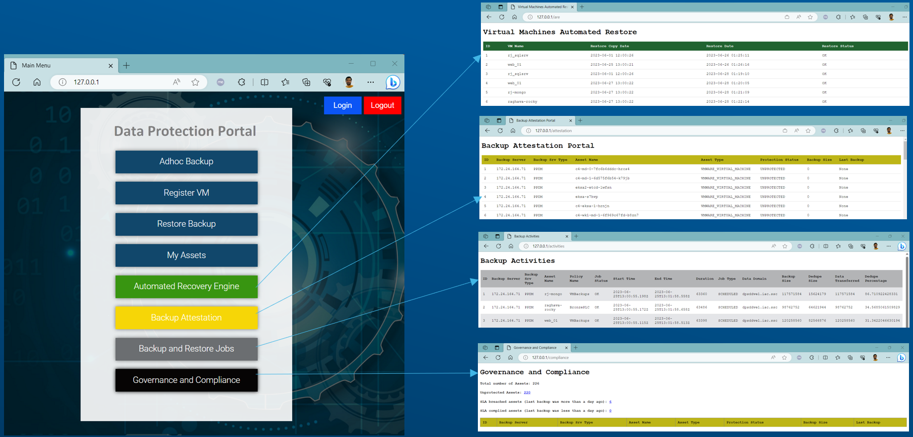
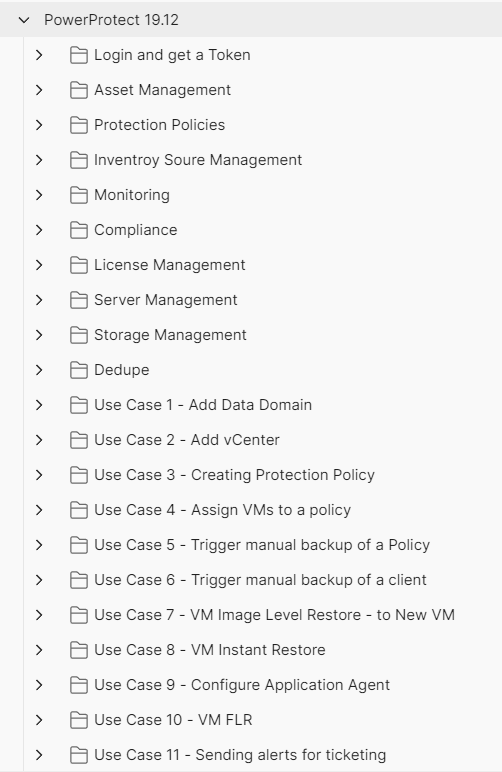

# Dell PowerProtect Data Manager Automation Examples Repository

Welcome to the Dell PowerProtect Data Manager (PPDM) Automation Examples repository! This repository contains a collection of automation examples and resources to help you interact with Dell's PPDM REST API. Whether you're looking to streamline your data management processes, integrate with other systems, or create custom dashboards, this repository provides a comprehensive set of examples to get you started.


## Introduction

Dell's PowerProtect Data Manager (PPDM) is a Modern Data Protection Software for backing up enterprise workloads (onprem & cloud). This repository aims to demonstrate how to interact with the PPDM REST API using various automation tools and technologies. The examples provided cover a wide range of scenarios, including using Postman collections, Ansible playbooks, Python scripts, integrating with ServiceNow, and creating a custom dashboard.

## Getting Started
To begin using the examples in this repository, follow these steps:

Clone this repository to your local machine:

```
git clone https://github.com/rjainoje/ppdm-automation.git
```

Navigate to the corresponding directory:

```
cd ppdm-ansible-playbooks
```

Explore the different folders corresponding to the automation tools and technologies you're interested in.


## Examples

This repository includes the following types of examples:

* [Postman Collections](./ppdm-postman-collections/postman-readme.md): Interact with the PPDM REST API using pre-configured Postman collections. These collections provide a user-friendly way to make API requests and explore the capabilities of PPDM. There are 11 use cases about configuring backups, restore and perform adhoc backups.

* [Ansible Playbooks](./ppdm-ansible-playbooks/ansible-readme.md): Automate PPDM-related tasks using Ansible playbooks. These playbooks offer a structured approach to automate routine tasks, configuration, and management. To begin with, i have self-service playbooks.

* [Python Scripts](./ppdm-python-restapi/python-readme.md): Develop custom Python scripts to interact with the PPDM REST API. These scripts can be tailored to your specific requirements and integrated into your automation workflows.

* [ServiceNow Example](./ppdm-servicenow-example/servicenow-readme.md): Learn how to leverage PPDM's REST API with ServiceNow for streamlined incident management, ticketing, and reporting.

* [Custom Dashboard](./rjapp-backup-portal-example/dashboard-readme.md): Build a custom dashboard to visualise PPDM metrics and insights, providing an at-a-glance view of your data management environment.






## Folder Structure
The repository is organized as follows:

```

/
|-- ppdm-ansible-playbooks/
|-- ppdm-dashboard-example/
|-- ppdm-postman-collections/
|-- ppdm-python-restapi/
|-- ppdm-servicenow-example/
|-- ppdm-splunk-example/
|-- images/
|-- LICENSE
|-- Readme.txt

```
Each folder contains examples, documentation, and resources specific to the corresponding technology.


## Contributions

I welcome contributions from the community! If you have additional examples, improvements, or fixes, please feel free to submit a pull request.

## Author

* **Raghava Jainoje** - [rjainoje](https://github.com/rjainoje)


## License

This project is licensed under the MIT License - see the [LICENSE](LICENSE) file for details