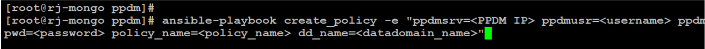

# Getting Started with PPDM REST API using Ansible Playbooks

[Git repo](/ppdm-ansible-playbooks):

## Introduction:
Dell PowerProtect Data Manager (PPDM) is a robust data protection software that plays a pivotal role in safeguarding both on-premises and cloud workloads. Automating data protection tasks is becoming increasingly vital, and this blog post aims to guide you through the process of automating PPDM operations using Ansible Playbooks. While we previously explored how to interact with PPDM's REST API using Postman, we'll now delve into the world of Ansible Playbooks to achieve seamless and efficient automation.

Ansible Playbooks are a powerful tool for automating a variety of tasks, including those in PPDM. In this blog post, we'll focus on automating the following operations:

Backup: Ansible playbook to perform ad-hoc backup of a client using REST API in PPDM.
Restore: Ansile playbook for restoring a VM
Policy Creation: Ansible playbook for creating a policy
Client Registration: Ansible playbook for client registration


## Prerequisites:
Before we dive into the automation process, let's ensure you have the necessary prerequisites in place:

* A basic understanding of Dell PowerProtect Data Manager and its REST API.
* Ansible installed on your system. If you need assistance with Ansible installation, you can refer to the official Ansible documentation.
* Access to a Dell PowerProtect Data Manager instance for testing and experimentation purposes.


## Setting Up the Environment:
Before we begin, let's make sure you have the required environment set up:

* Install Ansible on your machine by following the instructions provided in the official Ansible installation guide.
* Clone the Git repository containing the Ansible Playbooks we'll be using for PPDM automation. You can find the Playbooks here. With your environment ready, let's dive into the automation process!


## Executing Ansible Playbooks with Extra Vars

In this section, we'll guide you through the process of executing the Ansible Playbooks for automating various PPDM operations. Ansible allows us to pass extra variables (extra vars) to our Playbooks, making them flexible and adaptable to different scenarios. The required extra vars are listed in the playbooks.

* Open a terminal window
* Navigate to the directory where you cloned the Git repository containing the Ansible Playbooks.
* Run the following command, replacing the placeholders with your specific values:


1. Register a client
```
ansible-playbook register_client -e "ppdmsrv=<PPDM IP> ppdmusr=<username> ppdmpwd=<password> policy_name=<policy_name> asset_name=<asset>"
```

2. Create a policy
```
ansible-playbook create_policy -e "ppdmsrv=<PPDM IP> ppdmusr=<username> ppdmpwd=<password> policy_name=<policy_name> dd_name=<datadomain_name>"
```

3. Perform ad-hoc backup
```
ansible-playbook adhoc_backup -e "ppdmsrv=<PPDM IP> ppdmusr=<username> ppdmpwd=<password> asset_name=<asset>"
```

4. Perform VM restore
```
ansible-playbook restore_vm -e "ppdmsrv=<PPDM IP> ppdmusr=<username> ppdmpwd=<password> asset_name=<asset> vcenter_host=<vcenter> vuser=<vcenter user> vpassword=<vcenter pwd>"
```





## Contributions

I welcome contributions from the community! If you have additional examples, improvements, or fixes, please feel free to submit a pull request.


## Author

* **Raghava Jainoje** - [rjainoje](https://github.com/rjainoje)


## License

This project is licensed under the MIT License - see the [LICENSE](LICENSE) file for details