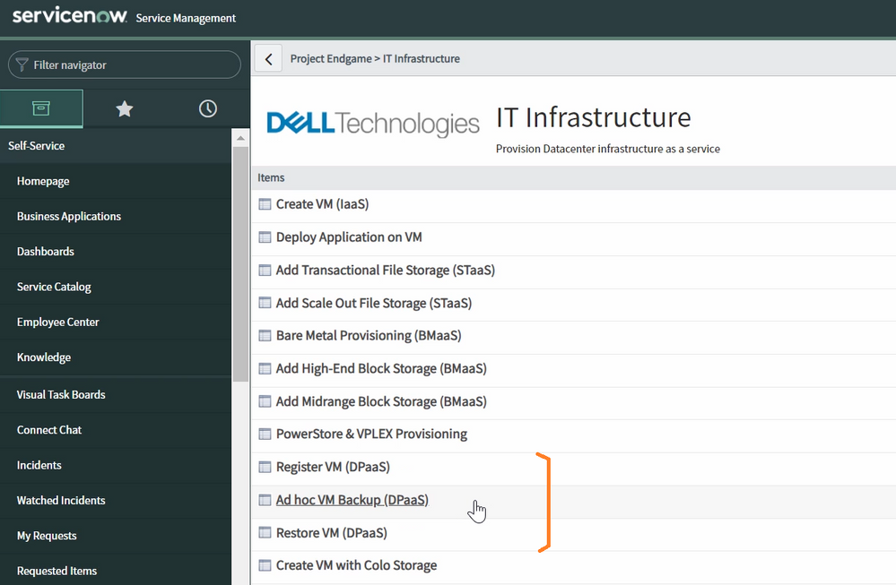

# PowerProtect Data Manager Self-service using ServiceNow
Here is the blog https://www.dell.com/community/en/conversations/developer-blogs/self-service-backup-with-ppdm-and-servicenow/647f9fc9f4ccf8a8de4b1744 

## Contributions

I welcome contributions from the community! If you have additional examples, improvements, or fixes, please feel free to submit a pull request.

## Author

* **Raghava Jainoje** - [rjainoje](https://github.com/rjainoje)

## License

This project is licensed under the MIT License - see the [LICENSE](LICENSE) file for details